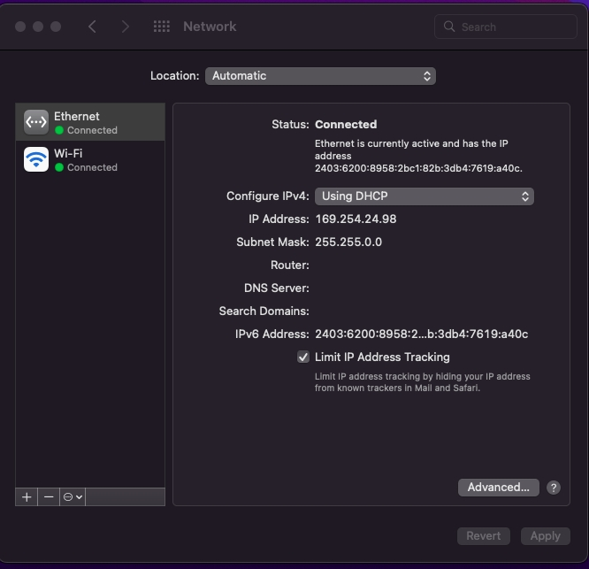

# Z690-Aorus-master-Monterey
### Hardware
```
CPU : 12900K / OC PCore : 5.2 ECore : 4.1
GPU : Sapphire VGA NITRO+ RX 6600 XT
M/B : Gigabyte Z690 Aorus Master
RAM : 2 x Crucial 16GB Unbuffered DDR5 4800MHz CL40 DIMM / OC 5400
Audio : Realtek ALC1220-VB
Lan : Marvell AQtion AQC113C 10GbE
```
### Add on
```
WIFI/BT : Fenvi FV-T919 1750Mbps
```
##### GeekBench 5
https://browser.geekbench.com/v5/cpu/12748649


### OS





